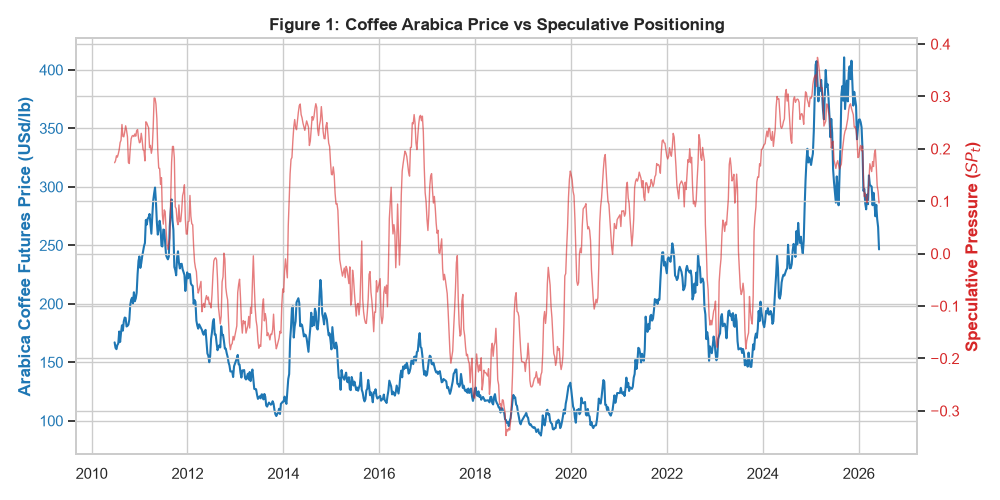

# Coffee Futures Market: Testing Speculative Pressure During Supply Shocks
Project Overview

This quantitative research project investigates the predictive power of speculative positioning on ICE U.S. Arabica Coffee futures returns. This study tests whether extreme net-long positioning by financial speculators acts as a contrarian signal (bubble reversal) or a momentum catalyst (limits to arbitrage) during severe physical supply shocks.
This repository serves as a portfolio project showcasing end-to-end quantitative skills: automated data engineering, handling of market microstructure biases, and robust econometric modeling.

Tech Stack & Methodology

Languages & Libraries: Python (Pandas, NumPy, Statsmodels, YFinance, Seaborn, Matplotlib).
Data Sources: * Futures Prices: ICE Arabica Coffee (C1) daily settlement prices.
Speculative Data: CFTC Disaggregated Commitments of Traders (COT) reports (Money Managers).
Risk-Free Rate: U.S. 3-Month Treasury Bill yield (^IRX).

Repository Structure

coffee_data_merger.py: The automated Data Engineering pipeline. It parses and merges fragmented historical CFTC text files, cleans the European format from the retail pricing data, dynamically fetches the risk-free rate, and outputs the final unified dataset.

coffee_analysis.py: The quantitative research script. It performs descriptive statistics, ADF stationarity tests, and the final OLS predictive regressions (with Newey-West HAC standard errors) across the full sample and the robustness sub-sample.

COFFEE_MERGED.xlsx: The clean and temporally aligned dataset resulting from the merger pipeline.

Addressing Look-Ahead Bias: Crucially, CFTC COT positions reflect the market state at Tuesday's close but are publicly released on Friday. Feeding Tuesday's data directly into a predictive algorithm would taint the analysis with "Look-Ahead Bias" (using data not yet available to traders). To ensure a robust out-of-sample simulation, the pipeline automatically shifts the COT dates to Friday, perfectly aligning them with the weekly settlement prices.

Econometric Framework

To evaluate the predictive power of Speculative Pressure ($SP_t$), I estimated the following forecasting regression:
$$R_{t+1} = \alpha + \beta_1 SP_t + \beta_2 R_t + \epsilon_{t+1}$$
Where:
$R_{t+1}$: Next-week excess log-return of the Arabica futures contract.
$SP_t$: Net position of Money Managers scaled by total open interest.
$R_t$: Lagged excess return to account for momentum effects. To handle potential volatility clustering and overlapping errors, the model was estimated using Ordinary Least Squares (OLS) with Newey-West HAC standard errors (4-week lag structure).

Visual Analysis

The dual-axis chart below illustrates the historical evolution of Arabica prices against the structural net-long positioning of Money Managers, capturing extreme fluctuations during the 2021 Brazilian frost and subsequent droughts.

Key Empirical Findings

Long-Term Market Efficiency (2010–2026): In the unconditional full sample ($N = 802$), speculative pressure exhibits no significant predictive power over future excess returns ($\beta_1 = -0.0072$, $p = 0.384$). Coffee futures behave largely like a martingale, confirming that under normal liquidity conditions, commercial hedging pressure is efficiently absorbed without generating a predictable risk premium.

Robustness Test - The 2021+ Shock Regime: To test for non-linearities and limits to arbitrage, a sub-sample analysis was conducted isolating the severe physical shortage triggered by the July 2021 Brazilian frost. Unlike the Cocoa market—which exhibited a verifiable commercial short-squeeze during its respective supply shock—the predictive coefficient for Arabica remained statistically insignificant ($p = 0.544$).

Conclusion:The findings suggest that the ICE Arabica market possesses superior liquidity depth and stronger arbitrage mechanisms compared to thinner agricultural derivatives. Even during historical climate shocks, extreme speculative positioning is efficiently priced in, failing to mechanically forecast subsequent price trajectories.

